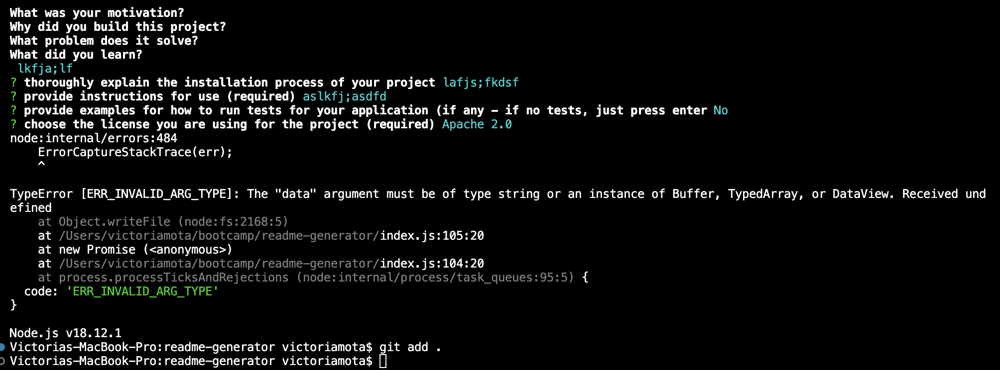

# Module 9 Challenge

README GENERATOR

## Description

Provide a short description explaining the what, why, and how of your project. Use the following questions as a guide:

The README Generator is meant to replace the hassle of having to configure and type out an entire README.md file from Scratch. Provided with all the appropriate responses, the generator will take the information from the prompts and apply them to the ready-made template, saving precious developer time and energy as the application simplifies the burden for beginners and veterans alike, and provides high quality README.md's with ease.

In the process of creating this application, I learned the proper syntax needed to run specific callbacks and promises, along with npm commands to navigate the node environment. Overall, the important concept of modules is also better situated in my mind.

## Installation

To utilize or see the functionality of the README.md Generator, you must git clone the repository first. After, ensure that Node,js is installed. Once ensured, type "node index" and prepare to answer the prompts ahead. 

## Usage

This application can only be used in the terminal. Ensuring Node.js is installed and started, you can run the program with node when following the installation instructions above. Once installed, a series of questions must be answered. Those answers will provide the data needed to fill out the new README.md file you want to create!

## Notes

I did run into a few issues along the way: one of them being not really knowing how to optimally format the document to receive the prompt inputs and the other being unable to actually create the README.md itself. I left an image of the final error received before final commit and push.

